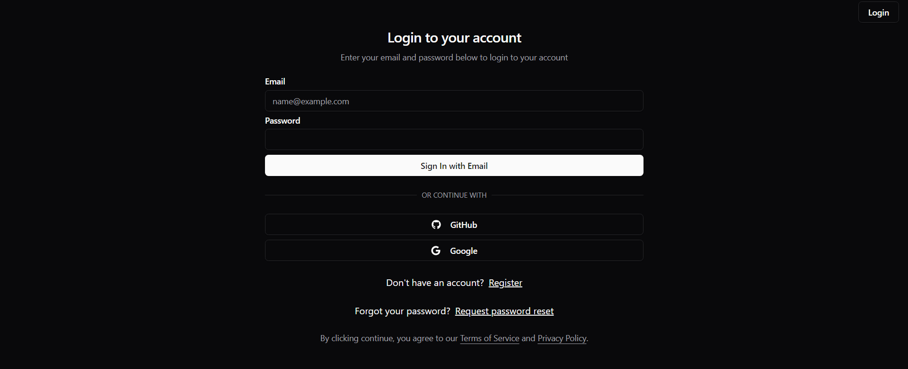
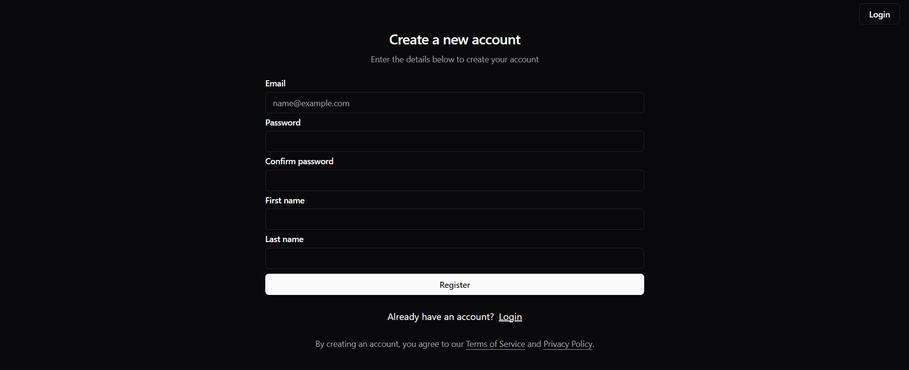
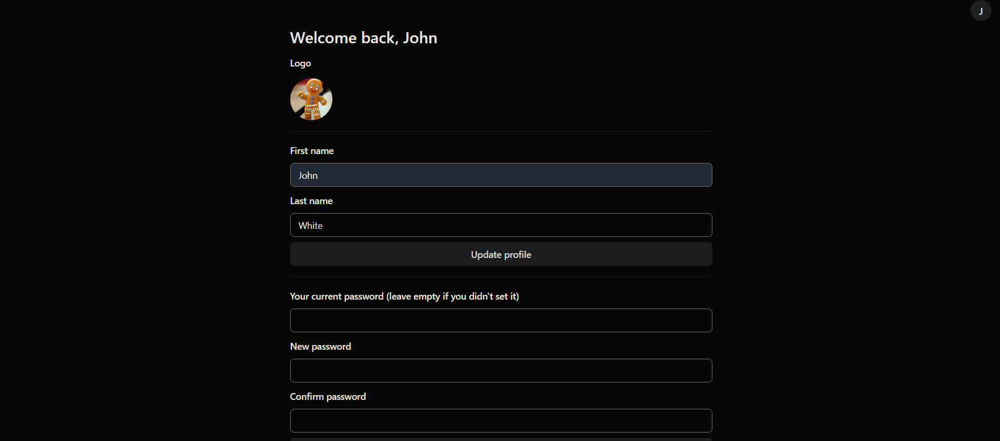

# Login Form

### Overview
The application is a form for entering a user profile or registering a new one. There is also an implementation of email verification, login using social networks and changing user credentials. The frontend is developed using React and the [backend](https://github.com/StudentPP1/login-form-backend) is developed using Spring Boot.

### Snapshot of Application

